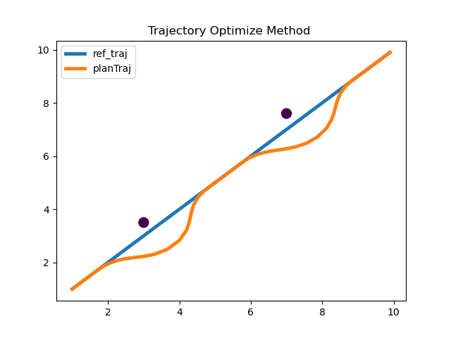

# Trajectory Optimizer based on TEB

[](LICENSE)
[]()
[]()

## 📖 项目简介

这是一个基于 **TEB (Timed Elastic Band)** 算法实现的轨迹优化器核心代码。

本项目剥离了复杂的 ROS 依赖（或简化了结构），旨在帮助开发者：
1.  深入理解 TEB 算法的底层原理与数学模型。
2.  提供一个轻量级的代码库，便于进行算法的二次开发与移植。

## 🚀 快速开始 (How to use)

请确保本地已安装 `CMake` 与 `C++` 编译器。

### 编译与运行

```bash
mkdir build
cd build
cmake ..
make
# 运行程序
./main
```

## 📊 运行效果 (Results)

下图展示了优化后的轨迹效果：

<p align="center">
  <!-- 建议使用相对路径，加载速度更快且稳定 -->
  
</p>

## 📚 详细教程与支持

关于代码的深度解析、数学原理以及更多机器人规划控制技术，请关注我的微信公众号。

*   **微信公众号**：机器人规划与控制研究所
*   **深度解析文章**：[从零开始使用C++实现TEB轨迹优化器](https://mp.weixin.qq.com/s/FoBB2sOjhOtjMi4x7hzpeA)

---
**Author**: JackJu-HIT
```
